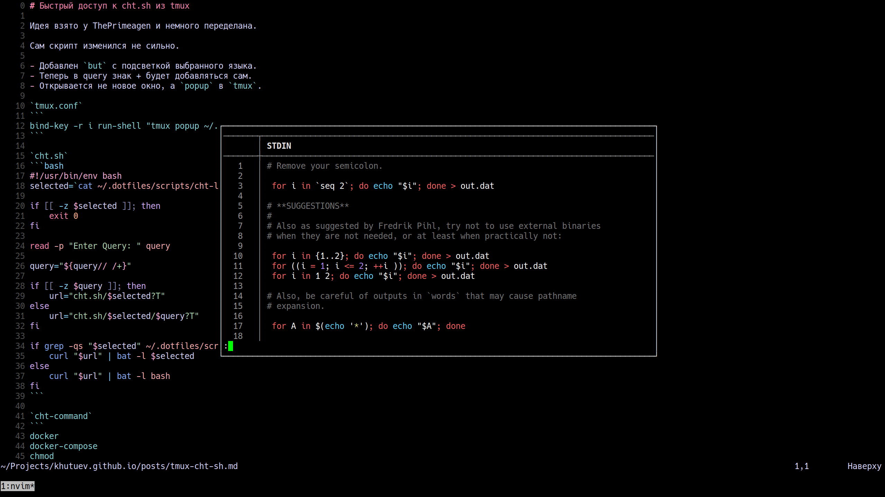

# Быстрый доступ к cht.sh из tmux

Идея взята у ThePrimeagen и немного переделана.

Сам скрипт изменился не сильно.

- Добавлен `bat` с подсветкой выбранного языка.
- Теперь в query знак + будет добавляться сам.
- Открывается не новое окно, а `popup` в `tmux`.



`tmux.conf`
```
bind-key -r i run-shell "tmux popup ~/.dotfiles/scripts/cht.sh"
```

`cht.sh`
```bash
#!/usr/bin/env bash
selected=`cat ~/.dotfiles/scripts/cht-languages ~/.dotfiles/scripts/cht-command | fzf`

if [[ -z $selected ]]; then
    exit 0
fi

read -p "Enter Query: " query

query="${query// /+}"

if [[ -z $query ]]; then
    url="cht.sh/$selected?T"
else
    url="cht.sh/$selected/$query?T"
fi

if grep -qs "$selected" ~/.dotfiles/scripts/cht-languages; then
    curl "$url" | bat -l $selected
else
    curl "$url" | bat -l bash
fi
```

`cht-command`
```
docker
docker-compose
chmod
grep
```

`cht-languages`
```
golang
javascript
typescript
lua
bash
sql
```
